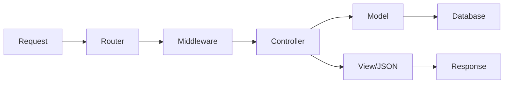

# PHP React MVC Template
{: .fs-9 }

A sophisticated web application framework that combines the robustness of PHP MVC architecture with the interactivity of React SPAs, implementing advanced design patterns and programming concepts.
{: .fs-6 .fw-300 }

[Get started now](#system-architecture){: .btn .btn-primary .fs-5 .mb-4 .mb-md-0 .mr-2 }
[View on GitHub](https://github.com/AwaisMehnga/php-react-starter-template){: .btn .fs-5 .mb-4 .mb-md-0 }

---

## System Architecture Overview

This template implements several sophisticated design patterns and programming concepts:

### Core Design Patterns

- **MVC (Model-View-Controller)**: Clean separation of concerns with dedicated layers
- **Singleton Pattern**: Database connections and application instance management  
- **Pipeline Pattern**: Middleware system for request/response processing
- **Active Record**: Object-oriented database interactions through models
- **Registry Pattern**: Middleware and route registration system
- **Factory Pattern**: Dynamic controller and model instantiation

### Request Processing Flow

```
HTTP Request → Router (FastRoute) → Application → Middleware Pipeline → Controller → Model → Database
                                                                       ↓
HTTP Response ← View/JSON ← Controller ← Model ← Database Operations
```

---

## How Each Component Works

### 1. **Routing System** - Request Dispatching

The routing system uses **FastRoute** library with custom middleware integration:

```php
// Route definition with fluent interface
Route::get('/users/{id}', [UserController::class, 'show'])
     ->middleware(['auth', 'throttle']);

// Compiled into optimized dispatcher
$dispatcher = FastRoute\simpleDispatcher(function(RouteCollector $r) {
    Route::setRouteCollector($r);
    // Load route files and register patterns
});
```

**How it works internally:**
- Routes are compiled into **optimized arrays** and **regular expressions**
- Static routes use **hash maps** for O(1) lookup performance
- Dynamic routes use **compiled regex patterns** for parameter extraction
- Middleware is applied using the **Pipeline Pattern**

### 2. **Controllers** - Request Handling

Controllers use **Reflection API** for automatic parameter injection:

```php
class UserController extends Controller
{
    public function show($id) // $id automatically injected from route
    {
        $user = User::find($id);
        return $this->json(['user' => $user]);
    }
}
```

**Programming concepts:**
- **Parameter Injection**: Uses `ReflectionMethod` to match route parameters
- **Template Method Pattern**: Base controller provides common functionality
- **Response Factory**: Methods like `json()`, `view()`, `redirect()`

### 3. **Middleware** - Request Pipeline

Implements the **Chain of Responsibility** pattern:

```php
// Middleware pipeline construction using array_reduce
$pipeline = array_reduce(
    array_reverse($middleware),
    function ($next, $middlewareName) {
        return function () use ($middlewareName, $next) {
            $middleware = new $middlewareName();
            return $middleware->handle($next);
        };
    },
    $destination // Final controller action
);
```

**How the pipeline works:**
- Each middleware **wraps** the next one in a closure
- Creates a "Russian Doll" structure of nested function calls
- Allows **before** and **after** request processing
- Enables **early termination** (auth failures, rate limiting)

---

## Quick Start

### 1. Clone the Template

```bash
git clone https://github.com/AwaisMehnga/php-react-starter-template.git my-project
cd my-project
```

### 2. Run Setup

```bash
php setup.php
```

This interactive setup will:
- Configure your project details
- Set up database connection
- Customize SPAs and routes
- Install dependencies

### 3. Start Development

```bash
# Start your web server (XAMPP, etc.)
# Visit http://localhost/my-project
```

---

## Architecture Overview

```
📁 Project Structure
├── app/
│   ├── Controllers/     # MVC Controllers
│   ├── Models/         # Data Models  
│   ├── Middleware/     # Request Middleware
│   └── Core/          # Framework Core
├── views/             # PHP Views
├── modules/           # React SPAs
├── routes/            # Route Definitions
├── config/            # Configuration
├── database/          # Database Schema
└── docs/             # Documentation
```

### MVC Flow



---

## Quick Examples

### Controller
```php
<?php
namespace App\Controllers;

use App\Core\Controller;
use App\Models\User;

class UserController extends Controller
{
    public function index()
    {
        $users = User::all();
        $this->view('users/index', ['users' => $users]);
    }
    
    public function show($id)
    {
        $user = User::find($id);
        $this->view('users/show', ['user' => $user]);
    }
}
```

### Routing
```php
// Simple routes
Route::get('/users', [UserController::class, 'index']);
Route::get('/users/{id}', [UserController::class, 'show']);

// Route groups with middleware
Route::group(['prefix' => 'admin', 'middleware' => ['auth']], function () {
    Route::get('/dashboard', [AdminController::class, 'dashboard']);
});
```

### Model
```php
<?php
namespace App\Models;

use App\Core\Model;

class User extends Model
{
    protected $fillable = ['name', 'email', 'password'];
    
    public static function findByEmail($email)
    {
        return static::where('email', $email)->first();
    }
}
```

### React SPA
```jsx
// modules/Dashboard/App.jsx
import React from 'react';

function Dashboard() {
    return (
        <div>
            <h1>Dashboard</h1>
            <p>Your React SPA content here</p>
        </div>
    );
}

export default Dashboard;
```

---

## Documentation

<div class="grid">
  <div class="grid-item">
    <h3><a href="guide/getting-started">🚀 Getting Started</a></h3>
    <p>Installation, setup, and first steps</p>
  </div>
  
  <div class="grid-item">
    <h3><a href="guide/controllers">🎮 Controllers</a></h3>
    <p>Creating and organizing controllers</p>
  </div>
  
  <div class="grid-item">
    <h3><a href="guide/models">🗃️ Models</a></h3>
    <p>Database models and relationships</p>
  </div>
  
  <div class="grid-item">
    <h3><a href="guide/routing">🛣️ Routing</a></h3>
    <p>Route definitions and middleware</p>
  </div>
  
  <div class="grid-item">
    <h3><a href="guide/spa-development">⚛️ React SPAs</a></h3>
    <p>Building React applications with Vite</p>
  </div>
  
  <div class="grid-item">
    <h3><a href="guide/database">🗄️ Database</a></h3>
    <p>Migrations, queries, and relationships</p>
  </div>
  
  <div class="grid-item">
    <h3><a href="guide/middleware">🔒 Middleware</a></h3>
    <p>Authentication, CORS, and request processing</p>
  </div>
  
  <div class="grid-item">
    <h3><a href="guide/deployment">🚀 Deployment</a></h3>
    <p>Production deployment and optimization</p>
  </div>
</div>

---

## Contributing

We welcome contributions! Please see our [Contributing Guide](contributing) for details.

---

## License

This template is open source and available under the [MIT License](https://github.com/AwaisMehnga/php-react-starter-template/blob/main/LICENSE).

<style>
.grid {
  display: grid;
  grid-template-columns: repeat(auto-fit, minmax(300px, 1fr));
  gap: 20px;
  margin: 20px 0;
}

.grid-item {
  padding: 20px;
  border: 1px solid #e1e4e8;
  border-radius: 6px;
  background: #f6f8fa;
}

.grid-item h3 {
  margin-top: 0;
}

.grid-item h3 a {
  text-decoration: none;
  color: #0366d6;
}

.grid-item p {
  margin-bottom: 0;
  color: #586069;
}
</style>
